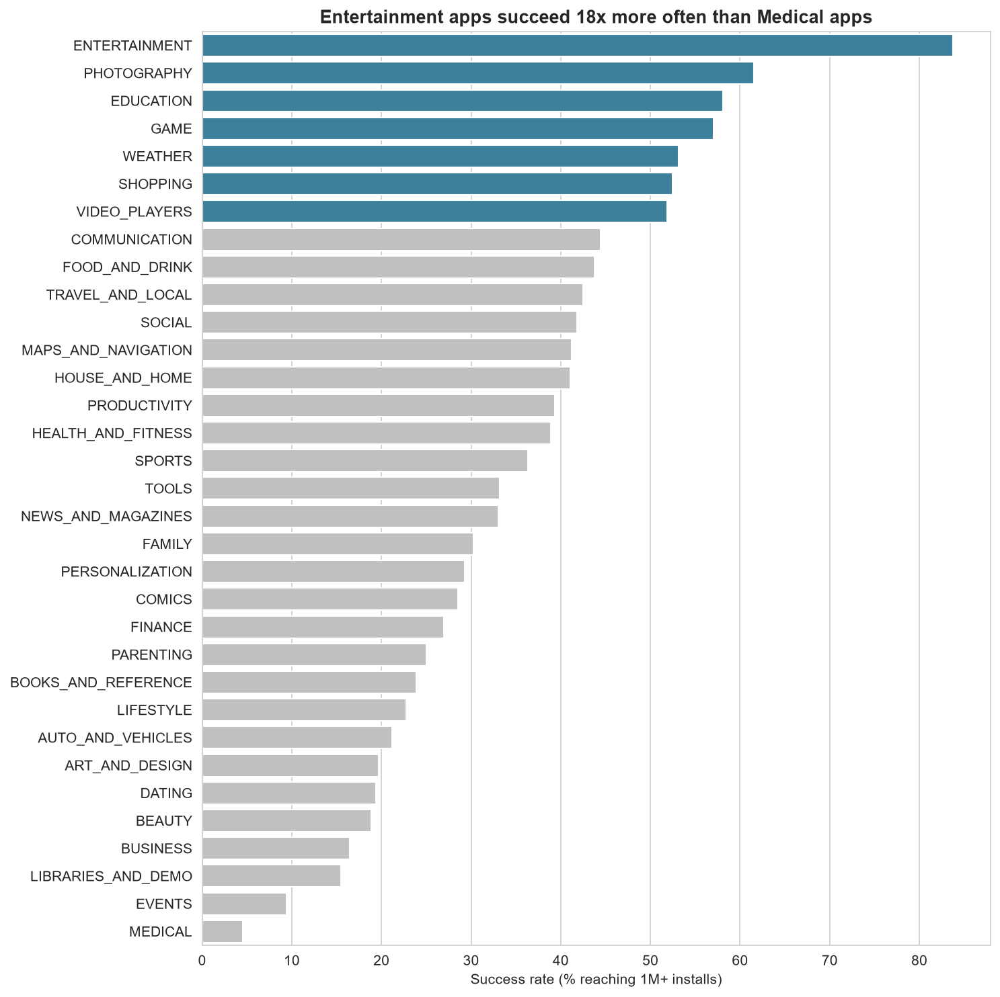
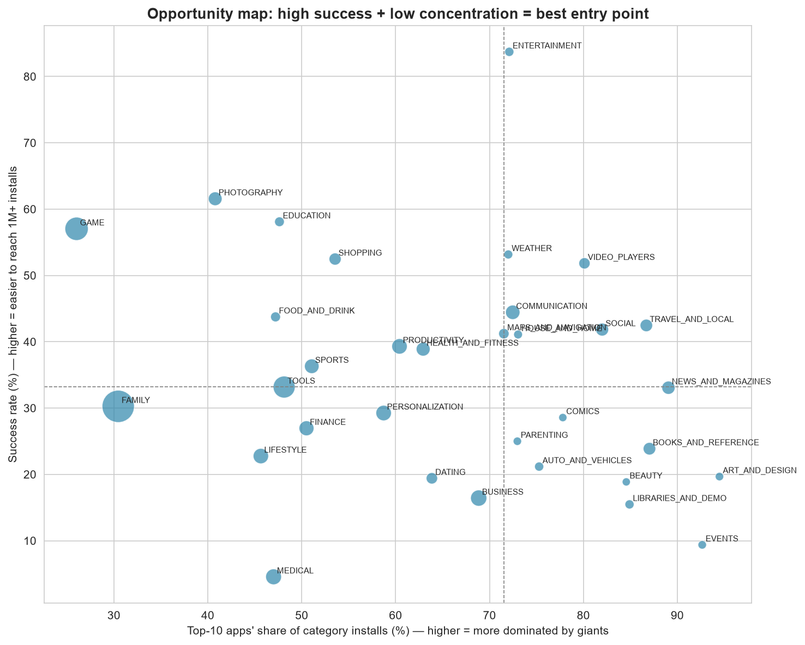
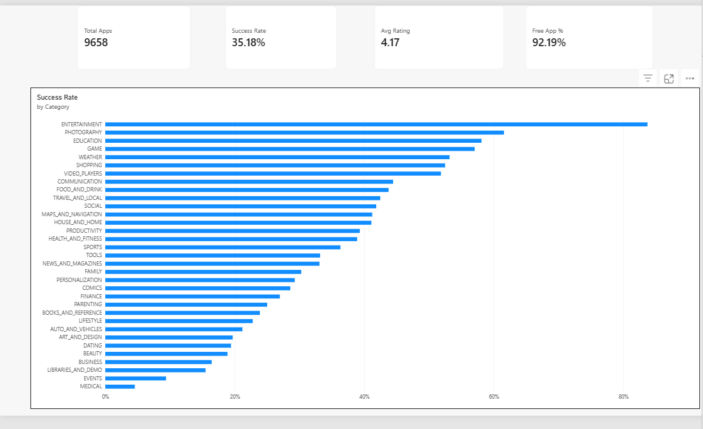

# 📱 Google Play Store Growth Analytics

**End-to-end data analytics project: SQL + Python + Statistics + Machine Learning + Business Strategy**

I analyzed 9,658 real Android apps to answer a concrete business question: which category,
pricing, and app-design choices give a new app the best odds of reaching 1M+ installs?
The project moves through market analysis (SQL), statistical proof (hypothesis testing),
predictive modeling (machine learning), and ends with a specific launch recommendation and
an estimated impact, backed by a proposed A/B test to validate it in the real world.

---

## Business Problem

A startup has budget to launch one Android app. As the analyst, I need to recommend
which category to enter, how to price it, and what quality bar to target, to maximize
the chance of reaching 1,000,000+ installs.

Success metric: an app "succeeds" if it reaches 1M+ installs.

## Data

Kaggle: Google Play Store Apps (https://www.kaggle.com/datasets/lava18/google-play-store-apps)
- ~10,800 apps, ~2018 snapshot, plus a user reviews file.

Known limitations:
- Snapshot data, no time series - "growth" is measured with proxies (installs, update recency, review rate)
- Installs are bucket floors (e.g. "1,000,000+"), not exact counts
- Findings show association, not proven causation

## Tools

Python (Pandas, NumPy, SciPy, scikit-learn) - SQL (SQLite) - Matplotlib/Seaborn -
Jupyter - Git/GitHub

## Repo Structure
 playstore-growth-analytics/
├── data/raw/ # original CSVs
├── data/cleaned/ # cleaned data + SQLite database
├── notebooks/
│ ├── 01_cleaning_features.ipynb
│ ├── 02_sql_analysis.ipynb
│ ├── 03_statistical_tests.ipynb
│ ├── 04_visualization.ipynb
│ ├── 05_machine_learning.ipynb
│ └── 06_recommendation_impact.ipynb
├── sql/01_market_structure.sql
├── images/ # saved charts
├── reports/executive_summary.md
└── README.md

---

## Step 1-2: Data Cleaning

Started with 10,841 raw rows, removed 1 corrupted row, 1 unreleased app, and
1,181 duplicate app names, leaving 9,658 unique apps. Fixed data types (Installs, Price,
Reviews, Size, dates), and left ~15% missing Ratings unfilled after confirming they
belong almost entirely to apps with near-zero reviews (median 1 review vs 3,017 for
rated apps).

## Step 3: Feature Engineering

Built Success (Installs >= 1M), Review_Rate, Days_Since_Update, and category
buckets for install tier, price, size, and update recency.

## Step 4: SQL Analysis

Loaded the cleaned data into SQLite and used window functions (ROW_NUMBER(),
PARTITION BY) to measure market concentration per category - see sql/01_market_structure.sql.

| Finding | Result |
|---|---|
| Category success rate | 4.6% (Medical) to 83.7% (Entertainment) - an 18x spread |
| Winner-takes-all check | Art & Design (94.5% top-10 install share) vs Game (26.0%) |
| Free vs Paid | 37.9% vs 0-4.8% success rate across price tiers |
| Update recency | 56.7% success (<=30 days) vs 18.5% (>1 year) |

## Step 5: Statistical Testing

Every SQL finding was tested formally with effect sizes and a Bonferroni-corrected
significance threshold (alpha = 0.01 across 5 tests):

| Hypothesis | Test | p-value | Effect size | Verdict |
|---|---|---|---|---|
| Category affects success | Chi-square | 3.53e-161 | Cramer's V = 0.299 | Confirmed |
| Free apps install more | Mann-Whitney U | 3.34e-116 | rank-biserial = 0.499 | Confirmed |
| Recency affects success | Chi-square | 7.10e-229 | Cramer's V = 0.332 | Confirmed |
| Larger apps install more | Spearman | 2.13e-187 | rho = 0.310 | Confirmed (reverses original hypothesis) |

## Step 6: Data Visualization


Entertainment succeeds 18x more often than Medical.


Combining success rate with market concentration reveals Entertainment as the
best entry point - high success without being a crowded, fragmented market
like Game or Family.

(See images/ for all 6 charts: free vs paid, update recency, size vs success, correlation heatmap.)

## Step 7: Machine Learning

Built a leakage-free Random Forest predicting Success from only pre-launch,
controllable features (Category, Price, Size, Content Rating, Update recency),
deliberately excluding Reviews and Rating, which are near-perfectly correlated
with the outcome itself (rho = 0.97 with Installs) and would leak the answer.

| Model | ROC-AUC |
|---|---|
| Dummy baseline | 0.500 |
| Logistic Regression | 0.763 |
| Random Forest | 0.828 |
| Random Forest (5-fold CV) | 0.819 +/- 0.004 |

Permutation importance (what actually drives success):
1. App size (0.100)
2. Update recency (0.077)
3. Category (0.060)
4. Price (0.047)
5. Content Rating (0.004)

These independently confirm the Step 5 statistical results, using a completely different method.

## Step 8: Recommendation & Estimated Impact

Recommendation: Launch a free app in Entertainment, sized near the 75th
percentile for the category, updated at least every 30 days.

Why: Entertainment has the highest opportunity score (83.7% success rate,
balanced against 72.1% market concentration) of any category with 50+ apps.

Estimated impact: predicted success probability rises from 45.5% to 75.0%
(+29.5 points, 95% CI: [28.5%, 30.5%]) under the recommended strategy vs. a typical launch.

Validation plan: a Google Play Console store-listing A/B test, 4,432 visitors
per arm (8,865 total) to detect a 12%->14% conversion lift at 80% power, with a
rating-floor guardrail (>=4.0) to stop early if quality drops.

Full write-up: reports/executive_summary.md

---

## Interactive Dashboard

Built in Power BI with 4 pages: Executive Overview, Category Deep Dive,
Pricing & Quality, and Recommendation.




*(Full .pbix file: `dashboard/playstore_dashboard.pbix`)*

---

## Limitations

- 2018 snapshot data - true install counts and real-time trends are unknown
- Association, not causation - category success may reflect demand more than any single app choice
- Model excludes marketing, brand, and ASO - real drivers not present in this dataset

## How to Run

```bash
pip install pandas numpy matplotlib seaborn scipy statsmodels scikit-learn
jupyter notebook
```
Run notebooks in order, 01 through 06.

---

Built by [TUSHAR KILORIYA] | [https://www.linkedin.com/in/tushar-dhakad-16a5b1328/] | [https://github.com/Tushar-oss-ai/playstore-growth-analytics]
